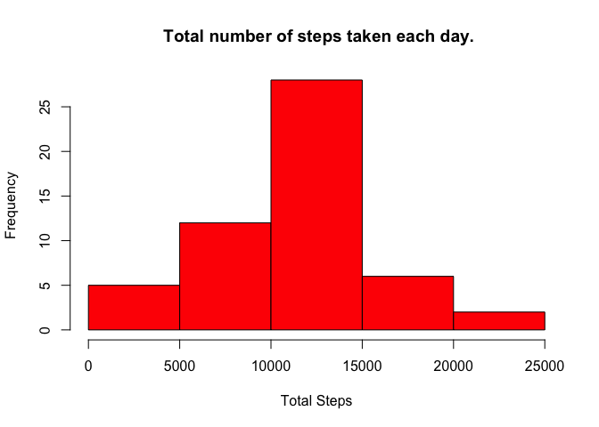
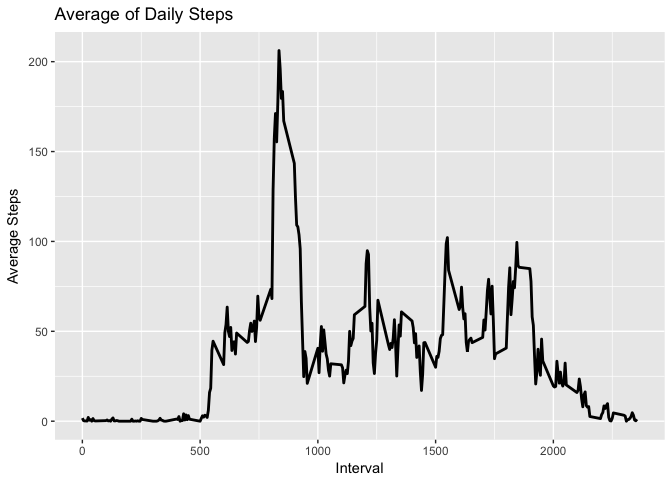
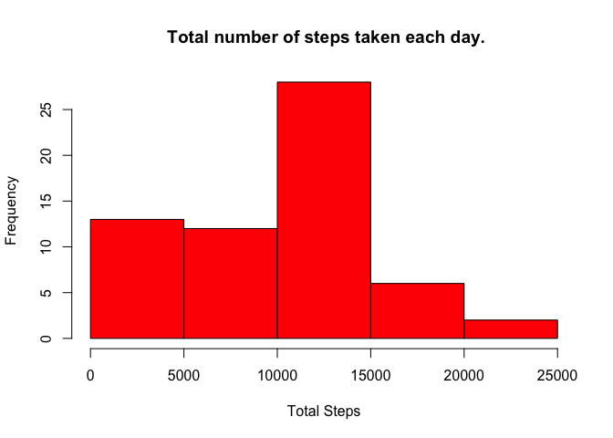
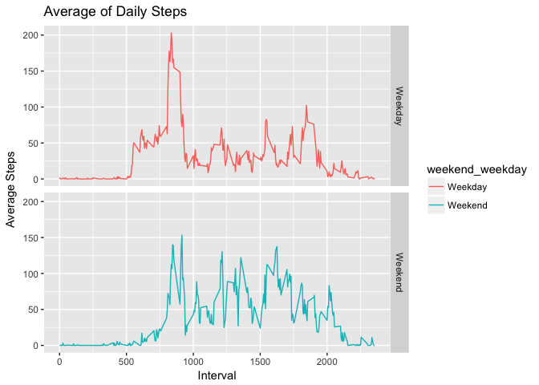

# Reproducible Research: Peer Assessment 1


## Loading and preprocessing the data

```r
unzip("activity.zip")
activtiy.data<-read.csv('activity.csv')
```
## What is mean total number of steps taken per day?

```r
##1.Calculate the total number of steps taken per day
total.steps.per.day<-activtiy.data%>%group_by(date)%>%summarise(total.steps=sum(steps))
##2. Make a histogram of the total number of steps taken each day
hist(total.steps.per.day$total.steps, col="Red", main=" Total number of steps taken each day.", xlab="Total Steps")
```

<!-- -->

```r
##3.Calculate and report the mean and median of the total number of steps taken per day
summary.inf<-total.steps.per.day%>%summarise(mean=mean(total.steps, na.rm= TRUE),
                                median=median(total.steps, na.rm=TRUE))
summary.inf
```

```
## # A tibble: 1 x 2
##       mean median
##      <dbl>  <int>
## 1 10766.19  10765
```
## What is the average daily activity pattern?

```r
##1.Make a time series plot of the 5-minute interval (x-axis) and the average number of steps taken, 
##averaged across all days (y-axis)
total.steps.by.intervals<-activtiy.data%>%group_by(interval)%>%summarise(average.steps=mean(steps,na.rm= TRUE))
ggplot(total.steps.by.intervals, aes(x = interval , y = average.steps)) +
  geom_line(color="black", size=1) + 
  labs(title = "Average of Daily Steps", x = "Interval", y = "Average Steps")
```

<!-- -->

```r
##2.Which 5-minute interval, on average across all the days in the dataset, contains the maximum number of steps
head(total.steps.by.intervals)
```

```
## # A tibble: 6 x 2
##   interval average.steps
##      <int>         <dbl>
## 1        0     1.7169811
## 2        5     0.3396226
## 3       10     0.1320755
## 4       15     0.1509434
## 5       20     0.0754717
## 6       25     2.0943396
```

```r
Max.intervals<-total.steps.by.intervals%>%data.frame()%>%filter(average.steps==max(average.steps, na.rm=TRUE))
Max.intervals
```

```
##   interval average.steps
## 1      835      206.1698
```

## Imputing missing values

```r
##1.Calculate and report the total number of missing values in the dataset
sum(is.na(activtiy.data))
```

```
## [1] 2304
```

```r
##2.impute missing value with median
overall.avg<-activtiy.data%>%summarise(median.avg=median(steps,na.rm=TRUE))
activiy.data.impute<-activtiy.data%>%mutate(steps=ifelse(is.na(steps), overall.avg, steps))%>%data.frame()
head(activiy.data.impute)
```

```
##   steps       date interval
## 1     0 2012-10-01        0
## 2     0 2012-10-01        5
## 3     0 2012-10-01       10
## 4     0 2012-10-01       15
## 5     0 2012-10-01       20
## 6     0 2012-10-01       25
```

```r
total.steps.per.day.new<-activiy.data.impute%>%group_by(date)%>%summarise(total.steps=sum(as.numeric(steps)))
##3. Make a histogram of the total number of steps taken each day
hist(total.steps.per.day.new$total.steps, col="Red", main=" Total number of steps taken each day.", xlab="Total Steps")
```

<!-- -->

```r
summary.inf.new<-total.steps.per.day.new%>%summarise(mean=mean(total.steps),
                                             median=median(total.steps))
summary.inf.new
```

```
## # A tibble: 1 x 2
##      mean median
##     <dbl>  <dbl>
## 1 9354.23  10395
```
## Are there differences in activity patterns between weekdays and weekends?

```r
##1. Create a new factor variable in the dataset with two levels – “weekday” and “weekend” 
##indicating whether a given date is a weekday or weekend day
activiy.data.impute$weekday <- weekdays(as.Date(activiy.data.impute$date))
activiy.data.days <-activiy.data.impute%>%
                  mutate(weekend_weekday=ifelse (weekday == "Saturday" | weekday == "Sunday", "Weekend", "Weekday"))

##2.Make a panel plot containing a time series plot 
total.steps.by.intervals.weekdays<-activiy.data.days%>%group_by(interval,weekend_weekday)%>%summarise(average.steps=mean(as.numeric(steps)))
ggplot(total.steps.by.intervals.weekdays, aes(x = interval , y = average.steps, color=weekend_weekday)) +
  geom_line() + 
  facet_grid(weekend_weekday ~ .) +
  labs(title = "Average of Daily Steps", x = "Interval", y = "Average Steps")
```

<!-- -->
